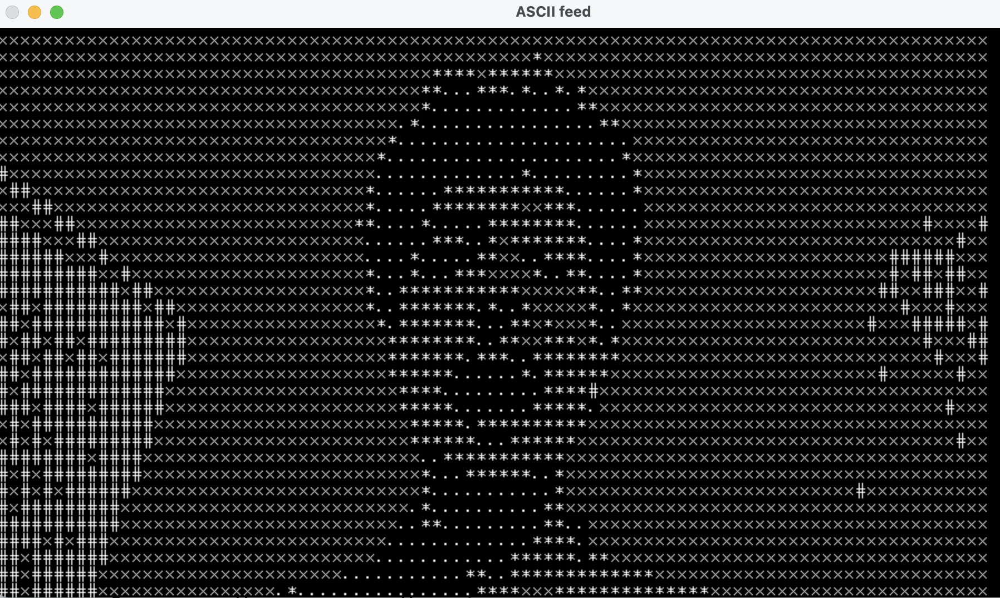

# ASCII Stream
Your webcam stream... converted to ASCII characters! 

## What does it do?
ASCII Stream takes your webcam feed and represents it in plain text! Perfect if you want to send a beautiful photo of yourself to a friend over just SMS. 

## How does it work?
The series of images (video stream) coming from the webcam are first compressed to a lower resolution. This is because a text character (like #) takes up many more pixels. So, by reducing the resolution, we essentially average the pixel values in a region before we represent them as an ASCII character. To choose which character to use, the program looks at the brightness value at each pixel of the downsized image, and chooses a ASCII character which takes up more or less space accordingly. For light values, characters like "#" are used, whereas for darker values, "." is used. 

The project uses opencv2 for all image processing tasks. 
